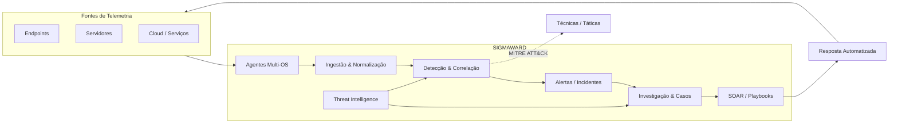

<div align="center">
  
</div>

<div align="center">
  <a href="README.md"></a>
  <a href="README-PT.md"></a>
  &nbsp;
  <a href="https://www.linkedin.com/in/wagner-bocchi"></a>
  <a href="https://bocchi.company"></a>
</div>

---

## Engenharia de sistemas que precisam sobreviver a adversários

Sou **Engenheiro de Software e profissional de Cibersegurança**, atuando entre segurança ofensiva, engenharia defensiva, automação e segurança de IA.

Meu trabalho vai além de operar produtos de segurança. Eu projeto software, analiso superfícies de ataque, construo tooling ofensivo, automatizo operações de segurança e arquiteturo plataformas de segurança do zero.

Sou certificado pela **Cisco como Ethical Hacker** e atualmente desenvolvo o **Sigmaward**, uma plataforma nativa de SIEM/SOAR/SOC construída do zero na **Bocchi Company**.

```text
BUILD  → entender o sistema
BREAK  → entender as premissas
DEFEND → projetar a resposta
```

### Domínios de engenharia

| Domínio | No que atuo |
|---|---|
| **Engenharia de Software** | Backend, APIs, serviços, integrações, automação e arquitetura |
| **Segurança Ofensiva** | Pentest, exploração web, ataques de infraestrutura, pós-exploração e cadeias de ataque |
| **Security Engineering** | Pipelines de detecção, telemetria, SIEM/SOAR, incident response e automação |
| **AI Red Team** | Prompt injection, abuso de agentes, tool misuse, superfícies de ataque em LLMs e testes adversariais |
| **Threat Modeling** | MITRE ATT&CK, attack paths, trust boundaries e arquitetura de aplicações/infraestrutura |

---

# Sigmaward

> **Uma plataforma de operações de segurança projetada como um único sistema — não como um conjunto de ferramentas desconectadas.**

O Sigmaward é meu principal projeto de engenharia: uma plataforma comercial de **SIEM + SOAR + SOC** com agentes próprios e uma arquitetura desenhada em torno de detecção, investigação, orquestração e resposta.



### O que estou projetando dentro da plataforma

```text
arquitetura de agentes     ingestão de eventos       normalização
correlação                 ciclo de detecção         alerting
gestão de incidentes       investigação              case management
orquestração SOAR          resposta automatizada     threat intelligence
MITRE ATT&CK mapping       multi-tenancy             APIs & integrações
security UX                arquitetura da plataforma resiliência operacional
```

O objetivo não é simplesmente coletar logs. É construir um **sistema operacional de segurança** capaz de transformar telemetria em decisões e decisões em resposta.

[**Explorar o repositório público do Sigmaward →**](https://github.com/wagnerbocchi/sigmaward-website)

---

## Segurança Ofensiva & Research

Encaro segurança ofensiva como uma disciplina de engenharia: entender a arquitetura, mapear relações de confiança, encontrar premissas inválidas e construir caminhos de ataque reproduzíveis.

**Áreas atuais de interesse:**

- Segurança de aplicações web e APIs
- Falhas de autenticação e autorização
- Pós-exploração e encadeamento de ataques
- Superfícies de ataque em Linux e containers
- Análise de redes e protocolos
- Ciclo de vida de vulnerabilidades e validação de remediação
- Tooling e automação de segurança
- Segurança de aplicações baseadas em LLMs e agentes
- Prompt injection e limites de controle de ferramentas

### Trabalho público em segurança

| Repositório | Foco |
|---|---|
| [**Web Security Academy Series**](https://github.com/wagnerbocchi/Web-Security-Academy-Series) | Pesquisa prática em exploração web e labs da PortSwigger |
| [**Pentest Cheat Sheet**](https://github.com/wagnerbocchi/Pentestcheatsheet) | Workflows ofensivos, comandos, referências de payloads e metodologia |
| [**Pentest Lab**](https://github.com/wagnerbocchi/pentest-lab) | Experimentação controlada em segurança ofensiva |
| [**Darkchecker**](https://github.com/wagnerbocchi/darkchecker) | Tooling e experimentação de segurança |
| [**awesome-blackhat-arsenal**](https://github.com/wagnerbocchi/awesome-blackhat-arsenal) | Pesquisa e referências de ferramentas ofensivas |

---

## AI Red Team

Superfícies de ataque modernas incluem cada vez mais **modelos, agentes, ferramentas, memória, sistemas de retrieval e workflows autônomos**.

Meu trabalho em segurança de IA foca em testar os limites entre o modelo e os sistemas que ele pode influenciar.

```text
Usuário / Atacante
       │
       ▼
    LLM / Agente
       │
       ├── Prompt & Contexto
       ├── Memória / RAG
       ├── Ferramentas / APIs
       ├── Conteúdo Externo
       └── Ações Autônomas
              │
              ▼
       Fronteira de Segurança
```

Entre os temas que exploro estão **prompt injection, indirect prompt injection, agent hijacking, excessive agency, invocação insegura de ferramentas, manipulação de contexto, caminhos de exfiltração de dados e avaliação adversarial**.

---

## Stack de engenharia

Prefiro descrever tecnologias pelo que faço com elas, em vez de manter uma parede de badges.

**Linguagens**  
`Python` · `Bash` · `TypeScript` · `JavaScript`

**Plataformas & Infraestrutura**  
`Linux` · `Docker` · `Cloud` · `Nginx` · `GitHub Actions` · `APIs` · `Containers`

**Segurança Ofensiva**  
`Burp Suite` · `Nmap` · `Metasploit` · `Wireshark` · `OWASP` · `MITRE ATT&CK`

**Security Engineering**  
`SIEM` · `SOAR` · `Detection Engineering` · `Incident Response` · `Threat Intelligence` · `Security Automation`

**Segurança de IA**  
`LLM Security` · `AI Agents` · `Prompt Injection` · `Adversarial Testing` · `Tool Security`

---

## Trabalhos de engenharia selecionados

| Projeto | Sinal de engenharia |
|---|---|
| [**Sigmaward**](https://github.com/wagnerbocchi/sigmaward-website) | Arquitetura de produto · SIEM/SOAR · Security Engineering · Telemetria multiagente |
| [**Web Security Academy Series**](https://github.com/wagnerbocchi/Web-Security-Academy-Series) | Pesquisa de vulnerabilidades · Exploração web |
| [**Pentest Cheat Sheet**](https://github.com/wagnerbocchi/Pentestcheatsheet) | Metodologia ofensiva · Engenharia de conhecimento |
| [**Darkchecker**](https://github.com/wagnerbocchi/darkchecker) | Security tooling · Experimentação de software |
| [**Bocchi Company Web**](https://github.com/wagnerbocchi/bocchi-company-web) | Engenharia de produto · Arquitetura web |

---

## Certificação

<div align="center">
  
  <br />
  <strong>Cisco Ethical Hacker</strong><br />
  <sub>Cisco Networking Academy</sub>
</div>

---

## Princípios de engenharia

```text
Segurança começa na arquitetura.
Automação deve reduzir carga cognitiva, não esconder complexidade.
Detecção sem resposta é apenas visibilidade.
Segurança ofensiva é uma forma de testar premissas de engenharia.
Bons produtos de segurança precisam ser bons produtos de software primeiro.
```

<div align="center">
  <br />
  <strong>Engenharia de Software × Segurança Ofensiva × Engenharia Defensiva × Segurança de IA</strong>
  <br /><br />
  <sub>Construindo sistemas de segurança. Quebrando premissas. Projetando defesas melhores.</sub>
</div>

<div align="center">
  
</div>
