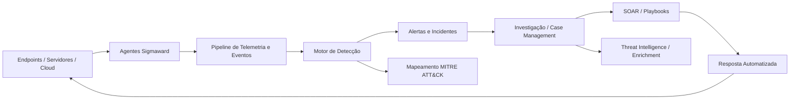

<div align="center">
  
</div>

<div align="center">
  <a href="README.md"></a>
  <a href="README-PT.md"></a>
</div>

<div align="center">
  <a href="https://www.linkedin.com/in/wagner-bocchi"></a>
  <a href="https://wagner.bocchi.company"></a>
  <a href="https://bocchi.company"></a>
</div>

---

## 👋 Sobre mim

Sou **Engenheiro de Software e profissional de Cibersegurança**, com foco tanto em construir quanto em quebrar sistemas.

Minha atuação fica na interseção entre **engenharia de software, segurança ofensiva, engenharia defensiva, automação e segurança de IA**. Trabalho com arquitetura de aplicações e infraestrutura, APIs, containers, cloud, pesquisa de vulnerabilidades, pós-exploração, engenharia de detecção, automação de resposta a incidentes e desenvolvimento de ferramentas de segurança.

Sou certificado pela **Cisco como Ethical Hacker** e atualmente desenvolvo o **Sigmaward**, uma plataforma SIEM/SOAR criada do zero na **Bocchi Company**.

```text
Construir sistemas. Quebrar premissas. Automatizar a defesa.
```

### No que atuo

- 🧑‍💻 **Engenharia de Software** — backend, APIs, serviços distribuídos, automação e tooling
- 🔴 **Red Team / Pentest** — web, infraestrutura, exploração, pós-exploração e cadeias de ataque
- 🤖 **AI Red Team** — segurança de LLMs, prompt injection, abuso de agentes, tool misuse e testes adversariais
- 🛡️ **Security Engineering** — SIEM/SOAR, detection engineering, telemetria e incident response
- ⚙️ **Automação de Segurança** — ferramentas em Python/Bash, integrações, playbooks e workflows de resposta
- 🧠 **Threat Modeling** — MITRE ATT&CK, attack paths, arquitetura de aplicações e pensamento adversarial

---

## 🛡️ Sigmaward

O **Sigmaward** é hoje meu principal projeto de engenharia de segurança: uma plataforma comercial de **SIEM / SOAR / SOC** desenvolvida como um produto unificado, em vez de uma composição de ferramentas desconectadas.

A proposta é oferecer uma única camada operacional para telemetria, detecção, investigação, automação e resposta.



### Áreas de engenharia dentro do Sigmaward

- Agentes de segurança multi-OS
- Ingestão e normalização de eventos
- Motor de detecção e correlação
- Ciclo de vida de alertas e incidentes
- Case management e workflows de investigação
- Resposta automatizada e orquestração de playbooks
- Threat intelligence e enrichment
- Mapeamento MITRE ATT&CK
- Arquitetura multi-tenant
- APIs e integrações
- Dashboards e UX orientados à operação de SOC

🌐 **Site público:** [sigmaward-website](https://github.com/wagnerbocchi/sigmaward-website)

---

## 🎯 Áreas principais

<div align="center">


</div>

---

## 🛠️ Stack tecnológica

### Linguagens & Engenharia

<div>
  
  
  
  
</div>

### Segurança

<div>
  
  
  
  
  
  
</div>

### Infraestrutura & DevOps

<div>
  
  
  
  
  
  
</div>

### AI / Segurança de LLMs

<div>
  
  
  
  
</div>

---

## 🚀 Repositórios selecionados

| Projeto | Área | Descrição |
|---|---|---|
| [**Sigmaward Website**](https://github.com/wagnerbocchi/sigmaward-website) | SIEM/SOAR · Engenharia de Software | Site público da plataforma Sigmaward, desenvolvido com Next.js, TypeScript e Tailwind CSS. |
| [**Web Security Academy Series**](https://github.com/wagnerbocchi/Web-Security-Academy-Series) | Web Security | Estudos práticos e pesquisa ofensiva sobre vulnerabilidades web. |
| [**Pentest Cheat Sheet**](https://github.com/wagnerbocchi/Pentestcheatsheet) | Pentest | Notas, comandos e referências para workflows de penetration testing. |
| [**Pentest Lab**](https://github.com/wagnerbocchi/pentest-lab) | Segurança Ofensiva | Ambiente de laboratório e material para testes de segurança e prática de exploração. |
| [**Darkchecker**](https://github.com/wagnerbocchi/darkchecker) | Security Tooling | Tooling e experimentação voltados à segurança. |
| [**Bocchi Company Web**](https://github.com/wagnerbocchi/bocchi-company-web) | Engenharia de Software | Projeto web público da Bocchi Company. |

---

## 🏆 Certificação

<div align="center">


**Cisco Ethical Hacker**  
Cisco Networking Academy

</div>

---

## 📊 GitHub Stats

<div align="center">
  
  
</div>

<div align="center">
  
</div>

---

<div align="center">
  <strong>Segurança não é um produto. É um processo de engenharia.</strong>
  <br /><br />
  <sub>Engenharia de Software · Segurança Ofensiva · Engenharia Defensiva · Segurança de IA</sub>
</div>

<div align="center">
  
</div>
