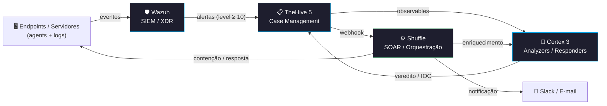

  

  
  
  

---

## 🛡️ Sobre mim

Profissional de **Cibersegurança** atuando na fronteira entre **Red e Blue Team**, com foco em **detecção, resposta a incidentes e automação**. Atualmente estou **arquitetando e implementando uma stack SOC/SOAR completa do zero** — do dimensionamento e instalação à engenharia de detecção e orquestração automatizada de playbooks.

- 🏗️ Desenhei uma arquitetura **faseada** (all-in-one → distribuída multi-node) com HA, DR e retenção de logs
- 🎯 **Detection Engineering**: tuning de regras Wazuh, redução de ruído na fonte e mapeamento MITRE ATT&CK
- 🤖 **SOAR**: enriquecimento e resposta automatizada (Cortex analyzers/responders + Shuffle workflows)
- 🐍 Automação ofensiva e defensiva em **Python** e **Bash**
- 🧠 Neurodivergente — penso naturalmente em sistemas, padrões e cadeias de ataque
- 💬 Fala comigo sobre: SIEM/SOAR, threat hunting, pentest, hardening Linux, detection-as-code

---

## 🔭 Stack SOC/SOAR que estou construindo

> Pipeline de detecção → triagem → enriquecimento → resposta automatizada. Hospedado em cloud com alta disponibilidade e disaster recovery.

---

## 🎯 Áreas de atuação

---

## 🛠️ Stack & Ferramentas

#### 🔐 Security & SecOps

  
  
  
  
  
  
  
  

#### 💻 Languages

  
  
  
  

#### ☁️ Infra & Cloud

  
  
  
  
  

#### 🧰 DevOps & Tools

  
  
  

---

## 💻 Projetos em destaque

> Foco em **automação de segurança, exploração e ferramentas de Red/Blue Team**.

🔐 **[Broken Authentication](https://github.com/wagnerbocchi/broken-authentication)** &nbsp;`Python` &nbsp;·&nbsp; `Offensive`
&nbsp;&nbsp;&nbsp;&nbsp;Suite para identificação de falhas de autenticação em apps web — brute-force, session fixation e bypass de fluxos de login.

📡 **[PKMID](https://github.com/wagnerbocchi/PKMID)** &nbsp;`Research` &nbsp;·&nbsp; `Networking`
&nbsp;&nbsp;&nbsp;&nbsp;Pesquisa em análise e manipulação de pacotes/protocolos de rede.

🥷 **[h4cker (fork)](https://github.com/wagnerbocchi/h4cker)** &nbsp;`Knowledge Base` &nbsp;·&nbsp; `DFIR`
&nbsp;&nbsp;&nbsp;&nbsp;Curadoria de recursos sobre ethical hacking, bug bounty e DFIR.

---

## 🏆 Certificações

<table align="center">
  <tr>
    <td align="center" width="200">
       
      <strong>Ethical Hacker</strong> 
      Cisco Networking Academy
    </td>
  </tr>
</table>

---

## 📊 GitHub Stats

  
  

  

---

  <i>"In a world full of <code>0</code>s and <code>1</code>s, be the <code>exception</code>."</i>
    
  Obrigado pela visita — abra uma <strong>issue</strong>, mande um <strong>PR</strong> ou troque ideia sobre segurança e tecnologia.

  

