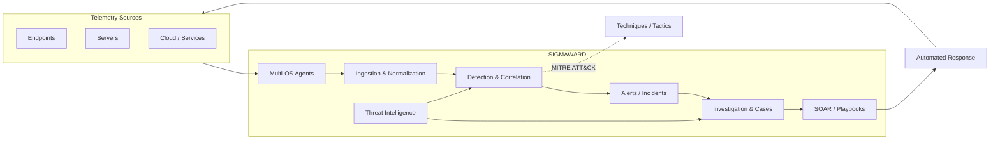

<div align="center">
  
</div>

<div align="center">
  <a href="README.md"></a>
  <a href="README-PT.md"></a>
  &nbsp;
  <a href="https://www.linkedin.com/in/wagner-bocchi"></a>
  <a href="https://bocchi.company"></a>
</div>

---

## Engineering systems that need to survive adversaries

I'm a **Software Engineer and Cybersecurity Engineer** working across offensive security, defensive engineering, automation, and AI security.

My work goes beyond operating security products. I design software, analyze attack surfaces, build offensive tooling, automate security operations, and architect security platforms from the ground up.

I'm certified by **Cisco as an Ethical Hacker** and currently building **Sigmaward**, a native SIEM/SOAR/SOC platform developed from scratch at **Bocchi Company**.

```text
BUILD  → understand the system
BREAK  → understand the assumptions
DEFEND → engineer the response
```

### Engineering domains

| Domain | What I work on |
|---|---|
| **Software Engineering** | Backend systems, APIs, services, integrations, automation, architecture |
| **Offensive Security** | Pentesting, web exploitation, infrastructure attacks, post-exploitation, attack chains |
| **Security Engineering** | Detection pipelines, telemetry, SIEM/SOAR, incident response, security automation |
| **AI Red Team** | Prompt injection, agent abuse, tool misuse, LLM attack surfaces, adversarial testing |
| **Threat Modeling** | MITRE ATT&CK, attack paths, trust boundaries, application and infrastructure architecture |

---

# Sigmaward

> **A security operations platform engineered as one system — not a bundle of disconnected tools.**

Sigmaward is my main engineering project: a commercial **SIEM + SOAR + SOC platform** with its own security agents and an architecture designed around detection, investigation, orchestration, and response.



### What I am engineering inside it

```text
agent architecture        event ingestion          normalization
correlation               detection lifecycle      alerting
incident management       investigation            case management
SOAR orchestration        automated response       threat intelligence
MITRE ATT&CK mapping      multi-tenancy            APIs & integrations
security UX               platform architecture    operational resilience
```

The objective is not simply to collect logs. The objective is to create an **operational security system** capable of turning telemetry into decisions and decisions into response.

[**Explore the Sigmaward public repository →**](https://github.com/wagnerbocchi/sigmaward-website)

---

## Offensive Security & Research

I approach offensive security as an engineering discipline: understand the architecture, map trust relationships, find invalid assumptions, then build reproducible attack paths.

**Current areas of interest:**

- Web application and API security
- Authentication and authorization failures
- Post-exploitation and attack chaining
- Linux and container attack surfaces
- Network and protocol analysis
- Vulnerability lifecycle and remediation validation
- Security tooling and automation
- LLM / agentic application security
- Prompt injection and tool-control boundaries

### Public security work

| Repository | Focus |
|---|---|
| [**Web Security Academy Series**](https://github.com/wagnerbocchi/Web-Security-Academy-Series) | Practical web exploitation research and PortSwigger labs |
| [**Pentest Cheat Sheet**](https://github.com/wagnerbocchi/Pentestcheatsheet) | Offensive workflows, commands, payload references and methodology |
| [**Pentest Lab**](https://github.com/wagnerbocchi/pentest-lab) | Controlled offensive-security experimentation |
| [**Darkchecker**](https://github.com/wagnerbocchi/darkchecker) | Security tooling and experimentation |
| [**awesome-blackhat-arsenal**](https://github.com/wagnerbocchi/awesome-blackhat-arsenal) | Offensive-security tooling research and references |

---

## AI Red Team

Modern attack surfaces increasingly include **models, agents, tools, memory, retrieval systems, and autonomous workflows**.

My AI security work focuses on testing the boundaries between the model and the systems it can influence.

```text
User / Attacker
      │
      ▼
   LLM / Agent
      │
      ├── Prompt & Context
      ├── Memory / RAG
      ├── Tools / APIs
      ├── External Content
      └── Autonomous Actions
             │
             ▼
       Security Boundary
```

Areas I explore include **prompt injection, indirect prompt injection, agent hijacking, excessive agency, unsafe tool invocation, context manipulation, data exfiltration paths, and adversarial evaluation**.

---

## Engineering stack

I prefer describing technologies by what I use them for rather than maintaining an exhaustive badge wall.

**Languages**  
`Python` · `Bash` · `TypeScript` · `JavaScript`

**Platforms & Infrastructure**  
`Linux` · `Docker` · `Cloud` · `Nginx` · `GitHub Actions` · `APIs` · `Containers`

**Offensive Security**  
`Burp Suite` · `Nmap` · `Metasploit` · `Wireshark` · `OWASP` · `MITRE ATT&CK`

**Security Engineering**  
`SIEM` · `SOAR` · `Detection Engineering` · `Incident Response` · `Threat Intelligence` · `Security Automation`

**AI Security**  
`LLM Security` · `AI Agents` · `Prompt Injection` · `Adversarial Testing` · `Tool Security`

---

## Selected engineering work

| Project | Engineering signal |
|---|---|
| [**Sigmaward**](https://github.com/wagnerbocchi/sigmaward-website) | Product architecture · SIEM/SOAR · Security Engineering · Multi-agent telemetry |
| [**Web Security Academy Series**](https://github.com/wagnerbocchi/Web-Security-Academy-Series) | Vulnerability research · Web exploitation |
| [**Pentest Cheat Sheet**](https://github.com/wagnerbocchi/Pentestcheatsheet) | Offensive methodology · Knowledge engineering |
| [**Darkchecker**](https://github.com/wagnerbocchi/darkchecker) | Security tooling · Software experimentation |
| [**Bocchi Company Web**](https://github.com/wagnerbocchi/bocchi-company-web) | Product engineering · Web architecture |

---

## Certification

<div align="center">
  
  <br />
  <strong>Cisco Ethical Hacker</strong><br />
  <sub>Cisco Networking Academy</sub>
</div>

---

## Engineering principles

```text
Security starts with architecture.
Automation should reduce cognitive load, not hide complexity.
Detection without response is only visibility.
Offensive security is a way to test engineering assumptions.
Good security products must be good software products first.
```

<div align="center">
  <br />
  <strong>Software Engineering × Offensive Security × Defensive Engineering × AI Security</strong>
  <br /><br />
  <sub>Building security systems. Breaking assumptions. Engineering better defenses.</sub>
</div>

<div align="center">
  
</div>
