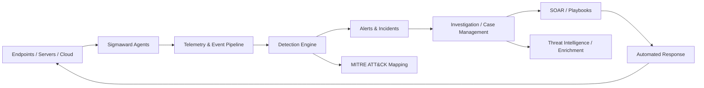

<div align="center">
  
</div>

<div align="center">
  <a href="README.md"></a>
  <a href="README-PT.md"></a>
</div>

<div align="center">
  <a href="https://www.linkedin.com/in/wagner-bocchi"></a>
  <a href="https://wagner.bocchi.company"></a>
  <a href="https://bocchi.company"></a>
</div>

---

## 👋 About me

I'm a **Software Engineer and Cybersecurity professional** focused on building and breaking systems.

My work sits at the intersection of **software engineering, offensive security, defensive engineering, automation, and AI security**. I work with application and infrastructure architecture, APIs, containers, cloud environments, vulnerability research, post-exploitation, detection engineering, incident-response automation, and security tooling development.

I am certified by **Cisco as an Ethical Hacker** and currently develop **Sigmaward**, a SIEM/SOAR platform built from scratch at **Bocchi Company**.

```text
Build systems. Break assumptions. Automate defense.
```

### What I work on

- 🧑‍💻 **Software Engineering** — backend, APIs, distributed services, automation and tooling
- 🔴 **Red Team / Pentesting** — web, infrastructure, exploitation, post-exploitation and attack chains
- 🤖 **AI Red Team** — LLM security, prompt injection, agent abuse, tool misuse and adversarial testing
- 🛡️ **Security Engineering** — SIEM/SOAR, detection engineering, telemetry and incident response
- ⚙️ **Security Automation** — Python/Bash tooling, integrations, playbooks and response workflows
- 🧠 **Threat Modeling** — MITRE ATT&CK, attack paths, application architecture and adversarial thinking

---

## 🛡️ Sigmaward

**Sigmaward** is the main security engineering project I am currently building: a commercial **SIEM / SOAR / SOC platform** designed as a unified product instead of a collection of disconnected security tools.

The goal is to provide a single operational layer for telemetry, detections, investigations, automation and response.



### Engineering areas inside Sigmaward

- Multi-OS security agents
- Event ingestion and normalization
- Detection and correlation engine
- Alert and incident lifecycle
- Case management and investigation workflows
- Automated response and playbook orchestration
- Threat intelligence and enrichment
- MITRE ATT&CK mapping
- Multi-tenant architecture
- APIs and integrations
- SOC-oriented dashboards and operational UX

🌐 **Public website:** [sigmaward-website](https://github.com/wagnerbocchi/sigmaward-website)

---

## 🎯 Core areas

<div align="center">


</div>

---

## 🛠️ Technology stack

### Languages & Engineering

<div>
  
  
  
  
</div>

### Security

<div>
  
  
  
  
  
  
</div>

### Infrastructure & DevOps

<div>
  
  
  
  
  
  
</div>

### AI / LLM Security

<div>
  
  
  
  
</div>

---

## 🚀 Selected repositories

| Project | Area | Description |
|---|---|---|
| [**Sigmaward Website**](https://github.com/wagnerbocchi/sigmaward-website) | SIEM/SOAR · Software Engineering | Public website for the Sigmaward cybersecurity platform, built with Next.js, TypeScript and Tailwind CSS. |
| [**Web Security Academy Series**](https://github.com/wagnerbocchi/Web-Security-Academy-Series) | Web Security | Practical studies and offensive-security research around web vulnerabilities. |
| [**Pentest Cheat Sheet**](https://github.com/wagnerbocchi/Pentestcheatsheet) | Pentesting | Notes, commands and references for penetration testing workflows. |
| [**Pentest Lab**](https://github.com/wagnerbocchi/pentest-lab) | Offensive Security | Lab environment and material for security testing and exploitation practice. |
| [**Darkchecker**](https://github.com/wagnerbocchi/darkchecker) | Security Tooling | Security-focused tooling and experimentation. |
| [**Bocchi Company Web**](https://github.com/wagnerbocchi/bocchi-company-web) | Software Engineering | Public web project for Bocchi Company. |

---

## 🏆 Certification

<div align="center">


**Cisco Ethical Hacker**  
Cisco Networking Academy

</div>

---

## 📊 GitHub stats

<div align="center">
  
  
</div>

<div align="center">
  
</div>

---

<div align="center">
  <strong>Security is not a product. It is an engineering process.</strong>
  <br /><br />
  <sub>Software Engineering · Offensive Security · Defensive Engineering · AI Security</sub>
</div>

<div align="center">
  
</div>
